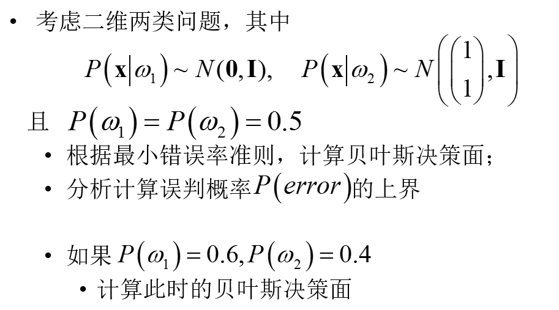

# 模式识别

左旺孟老师。考试课。

## 考试

开卷，什么东西都带上吧。。

选择，简答，计算，证明

选择题大部分都在ppt里，但是有些比较细的东西，必须熟练内容，才翻得快。

简答原题：

为什么基于核函数的支持向量机要采用对偶形式？（大概）ppt里有提到点。

朴素贝叶斯分类器中，最大似然估计与最大后验概率估计的区别？

ppt里没提，先看下这两个的公式，就知道这个很多书上有提到。只不过换了个说法。

计算证明：

注意平时的作业，基本都是考试的必考点。

一个计算最大似然的。

一个计算神经网络的前向传播。

一个证明两个神经网络等同，与作业这个相关

`分析对数Sigmoid函数和双曲正切Sigmoid函数的关系，并推导对数Sigmoid函数的一阶导数`

计算贝叶斯决策面（ppt里的题）：

证明：街道距离>欧式距离>明式距离（也与作业相关，但是我作业就是瞎写的。。）

## 项目

一个判断心脏病的逻辑回归，测试先验项（正则项）的影响

一个特征的前向后向搜索，对心脏病分类的影响

一个LDA和PCA+LDA人脸识别，研究PCA的影响

具体要求没说。。如果全部用工具包函数的话，可能也行吧。

自己写难度有点高~

占30%左右的分数，所以尽量做得好一点吧。

说是会查重，抄袭可能GG。